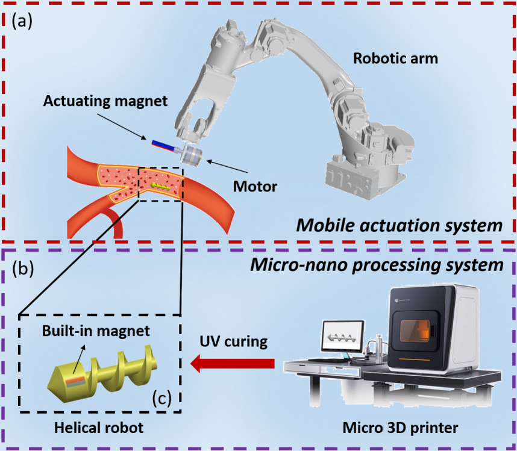
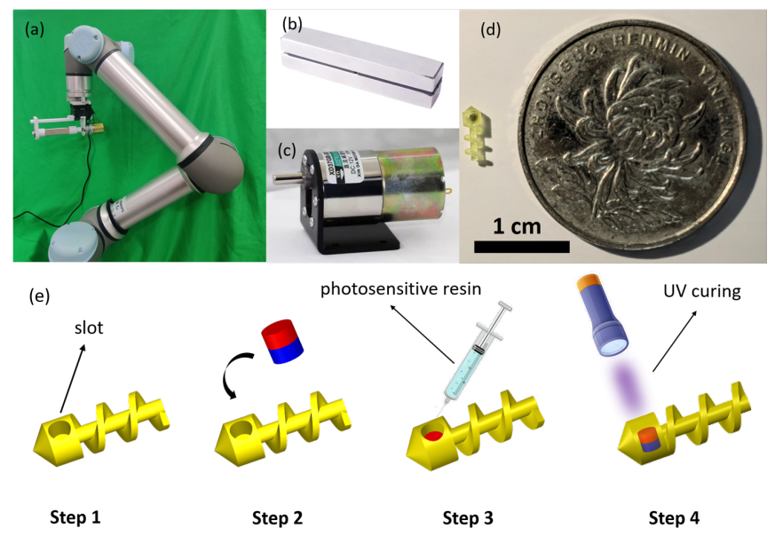
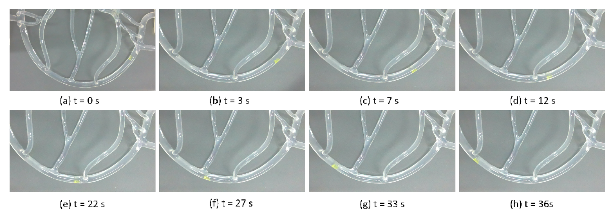

Mengde Li, Chong Huang, Fuqiang Zhao, Mingchang Li, Yang Li, Sheng Liu, and Miao Li

# Introduction

# Setup

# Experiment

# Videos

## 1. Experimental results in an S-shape path

<iframe width="560" height="315" src="https://www.youtube.com/embed/RnPYRRipUUA" title="YouTube video player" frameborder="0" allow="accelerometer; autoplay; clipboard-write; encrypted-media; gyroscope; picture-in-picture" allowfullscreen></iframe>

## 2. Experimental results in a simulated vascular environment

<iframe width="560" height="315" src="https://www.youtube.com/embed/GuADwI8vneA" title="YouTube video player" frameborder="0" allow="accelerometer; autoplay; clipboard-write; encrypted-media; gyroscope; picture-in-picture" allowfullscreen></iframe>

